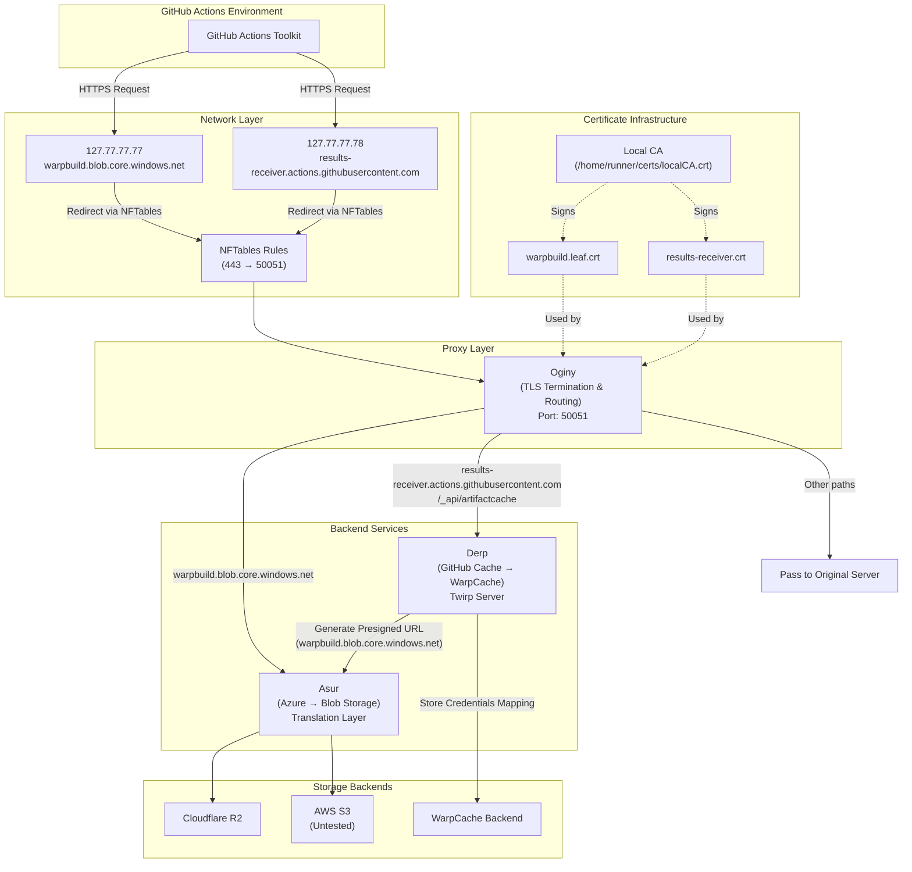

# Transparent Cache

## Overview

Transparent cache allows users to use WarpCache without any changes to their workflows. It works by intercepting and redirecting all GitHub Cache requests to our servers.

## Components

- Oginy: A lightweight proxy server that can terminate TLS and forward requests to the correct proxy server.

- Derp: Dummy Github Cache twirp server that translates requests from github toolkit to WarpCache backend

- Asur: A super-fast azure client to any blob storage translation layer. It currently supports:
  - Cloudflare R2
  - AWS S3 (Untested)

## How it Works

### 1. Loopback IPs and Hostname Mappings

We create a loopback alias per hostname for nftables.

```bash
ip addr add 127.77.77.77/32 dev lo   # warpbuild.blob.core.windows.net
ip addr add 127.77.77.78/32 dev lo   # results-receiver.actions.githubusercontent.com

printf "127.77.77.77 warpbuild.blob.core.windows.net\n" >> /etc/hosts
printf "127.77.77.78 results-receiver.actions.githubusercontent.com\n" >> /etc/hosts
```

This will now redirect all requests to `warpbuild.blob.core.windows.net` and `results-receiver.actions.githubusercontent.com` to the loopback interface. Now, we need to forward these 443 requests to the proxy server domain at 50051.

### 2. NfTables Rules

We create a `nftables` rule to forward all requests to the proxy server domain at 50051.

```bash
nft 'add table ip nat' 2>/dev/null || true
nft 'add chain ip nat output { type nat hook output priority 0; }' 2>/dev/null || true
nft add rule ip nat output ip daddr 127.77.77.77 tcp dport 443 redirect to :50051
nft add rule ip nat output ip daddr 127.77.77.78 tcp dport 443 redirect to :50051
```

### 3. Local CA and SAN Leaf Certs

GitHub's actions toolkit will communicate with our proxy over HTTPS which requires a valid certificate. We create a local CA and a SAN leaf certificate for each hostname. We also need to make node trust the local CA.

```bash
CERT_DIR=/home/runner/certs
mkdir -p "$CERT_DIR" && cd "$CERT_DIR"

# Root CA (trust this in clients)
openssl req -x509 -newkey rsa:2048 -nodes -days 825 \
  -keyout localCA.key -out localCA.crt \
  -subj "/CN=WarpBuild Local CA" \
  -addext "basicConstraints=critical,CA:TRUE,pathlen:0" \
  -addext "keyUsage=critical,keyCertSign,cRLSign"

# ---- warpbuild.blob.core.windows.net leaf ----
openssl req -new -newkey rsa:2048 -nodes \
  -keyout warpbuild.key -out warpbuild.csr \
  -subj "/CN=warpbuild.blob.core.windows.net"

cat > warpbuild.ext <<'EOF'
[v3_req]
subjectAltName=DNS:warpbuild.blob.core.windows.net
basicConstraints=CA:FALSE
keyUsage=digitalSignature,keyEncipherment
extendedKeyUsage=serverAuth
EOF

openssl x509 -req -in warpbuild.csr \
  -CA localCA.crt -CAkey localCA.key -CAcreateserial \
  -out warpbuild.leaf.crt -days 365 -sha256 \
  -extfile warpbuild.ext -extensions v3_req

# ---- results-receiver.actions.githubusercontent.com leaf ----
openssl req -new -newkey rsa:2048 -nodes \
  -keyout results-receiver.key -out results-receiver.csr \
  -subj "/CN=results-receiver.actions.githubusercontent.com"

cat > results-receiver.ext <<'EOF'
[v3_req]
subjectAltName=DNS:results-receiver.actions.githubusercontent.com
basicConstraints=CA:FALSE
keyUsage=digitalSignature,keyEncipherment
extendedKeyUsage=serverAuth
EOF

openssl x509 -req -in results-receiver.csr \
  -CA localCA.crt -CAkey localCA.key -CAcreateserial \
  -out results-receiver.crt -days 365 -sha256 \
  -extfile results-receiver.ext -extensions v3_req

# Quick sanity
openssl verify -CAfile localCA.crt warpbuild.leaf.crt results-receiver.crt
```

Make Node trust the local CA. Github uses node to run the actions.

```bash
export NODE_OPTIONS=--use-openssl-ca
export NODE_EXTRA_CA_CERTS=/home/runner/certs/localCA.crt
```

### 4. Oginy

Oginy's job is to take the request from these 2 hostnames and forward them to the correct proxy server.

For example, if the request is to `warpbuild.blob.core.windows.net`, Oginy will forward the request to the Asur proxy server.

If the request is to `results-receiver.actions.githubusercontent.com`, Oginy will forward the request to the Derp proxy server. However, in this case, it will only forward the requests with /\_api/artifactcache in the path. Other requests will be passed through to the original server.

### 5. Derp

Derp is a twirp server that translates requests from github toolkit to WarpCache backend. It's job is to generate a local presigned URL (with warpbuild.blob.core.windows.net as the hostname) that will be given to the toolkit. It will also maintain a mapping of the credentials to the URL generated which can be used to connect to the actual blob storage.

### 6. Asur

Asur is a super-fast azure client to any blob storage translation layer. It works by proxying the azure request to other blob storage providers. The speed advantage comes from the fact that we do no maintain state in the memory.

### Architecture Diagram



## Tasks:

- Figure out nftables alternative for Mac OS.
- Productionize Oginy
  - Add pass through rules for all other paths than /\_api/artifactcache
- Productionize Derp
- Productionize Asur
- Add support for AWS S3 in Asur
- Add support for temp credentials for R2 in WarpCache backend
- Figure out a production friendly way to generate and add certs in VMs.
- Testing
